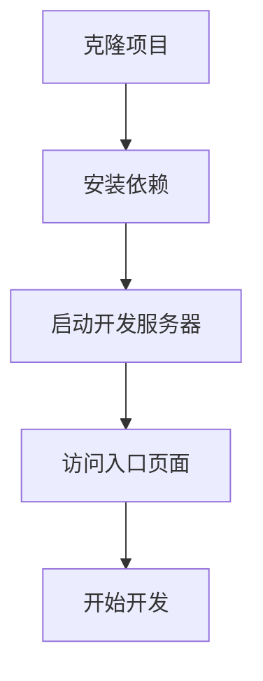

## 1. 产品概述

Vue3 企业级脚手架，基于最新技术栈构建现代化 Web 应用。提供开箱即用的开发环境，集成主流 UI 框架和样式解决方案，让开发者专注于业务逻辑实现。

## 2. 核心特性

### 2.1 技术栈优势

| 技术组件         | 版本  | 核心优势                               |
| ------------ | --- | ---------------------------------- |
| Vue.js       | 3.x | Composition API，性能优化，TypeScript 支持 |
| Tailwind CSS | 3.x | 原子化 CSS，快速样式开发，响应式设计               |
| Element Plus | 最新  | 企业级 UI 组件库，完善的表单和数据展示组件            |
| Vite         | 最新  | 极速热更新，优化的构建性能                      |

### 2.2 项目结构

项目采用模块化架构，主要包含以下核心目录：

* `src/components/` - 可复用 Vue 组件

* `src/views/` - 页面级组件

* `src/router/` - 路由配置

* `src/store/` - 状态管理

* `src/assets/` - 静态资源

* `src/utils/` - 工具函数

### 2.3 开发效率提升

* **零配置启动**：内置 Vite 配置，无需额外构建配置

* **热重载支持**：代码修改即时生效，提升开发体验

* **自动导入**：Element Plus 组件自动按需导入

* **样式智能提示**：Tailwind CSS 类名智能提示和验证

## 3. 核心流程

### 3.1 项目初始化流程



### 3.2 开发工作流

1. **页面开发**：在 `src/views/` 创建新的页面组件
2. **组件封装**：将可复用逻辑提取到 `src/components/`
3. **路由配置**：在 `src/router/index.js` 添加路由映射
4. **状态管理**：使用 Pinia 管理全局状态
5. **样式编写**：使用 Tailwind CSS 工具类快速构建样式

## 4. 用户界面设计

### 4.1 设计规范

* **主色调**：Element Plus 默认蓝色系 (#409EFF)

* **辅助色**：成功绿(#67C23A)、警告黄(#E6A23C)、错误红(#F56C6C)

* **字体**：系统默认字体栈，确保跨平台一致性

* **布局**：12列栅格系统，响应式断点设计

* **圆角**：基础圆角 4px，大圆角 8px

### 4.2 组件风格

* **按钮**：圆角矩形，支持主要/次要/危险等语义化样式

* **表单**：统一的标签对齐和验证提示样式

* **表格**：斑马纹行背景，悬停高亮效果

* **卡片**：轻微阴影和圆角，提升层次感

### 4.3 响应式设计

* **桌面端优先**：默认针对 1920x1080 分辨率优化

* **平板适配**：768px 断点，调整布局为两列

* **移动端**：375px 断点，单列垂直布局

* **触摸优化**：按钮最小点击区域 44x44px

## 5. 快速开始

### 5.1 环境要求

* Node.js >= 16.0.0

* npm >= 7.0.0 或 yarn >= 1.22.0

### 5.2 项目初始化

```bash
# 克隆项目
git clone [项目地址]
cd [项目目录]

# 安装依赖
npm install
# 或
yarn install

# 启动开发服务器
npm run dev
# 或
yarn dev
```

### 5.3 构建部署

```bash
# 生产环境构建
npm run build
# 或
yarn build

# 预览构建结果
npm run preview
# 或
yarn preview
```

### 5.4 代码规范

* 使用 ESLint 进行代码检查

* 使用 Prettier 进行代码格式化

* Git 提交信息遵循 Conventional Commits 规范

## 6. 扩展功能

### 6.1 推荐插件

* **Vue DevTools**：浏览器调试工具

* **Tailwind CSS IntelliSense**：样式类名智能提示

* **Element Plus Snippets**：组件代码片段

### 6.2 性能优化

* 路由懒加载

* 组件按需导入

* 图片资源压缩

* CDN 加速配置

